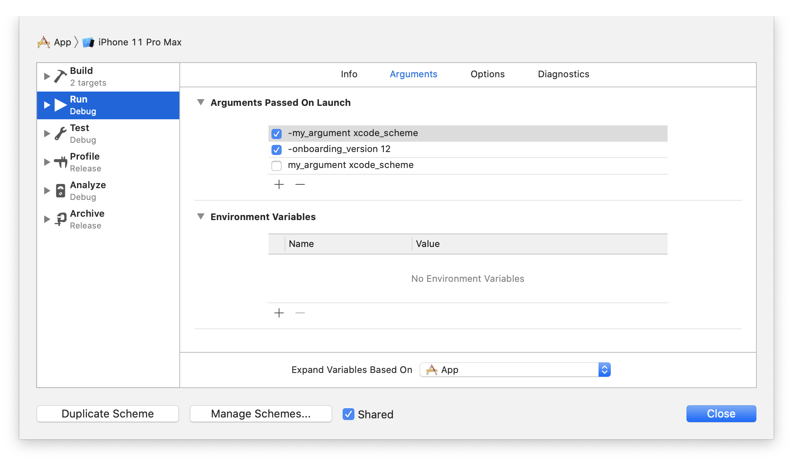

#  UI тесты на iOS / Аргументы запуска приложения

Одной из первых необходимостей при начале UI тестирования приложения встает вопросы передачи параметров для настройки приложения.

- Это может быть связано с невозможностью протестировать часть функционала на симуляторе.
- Передать конфигурацию или или фича флаги.
- Настроить URL для общения с сервером.
- Установить или стереть авторизационные данные.

## Установка аргументов

### XCUIApplication

Для передачи аргументов из UI тестов в приложение достаточно воспользоваться свойством `launchArguments`.

```swift
// AppUITests Target
let app = XCUIApplication()
app.launchArguments = ["-my_argument", "test_value"]
app.launch()
```

`launchArguments` - это массив сторок.

- Для передачи `Bool` достаточно просто самого аргумента. `["-is_ui_test"]`
- Для передачи значения оно должно стоять сразу после ключа `["-key", "value"]`

### XCode

`launchArguments` делают тоже самое, что и Xcode Scheme.

Мы можем в ручную прописать для нужной нам схемы аргументы, которые Xcode передаст при запуске приложения. Это может помочь в отладке приложения.

Для настройки аргументов откройте в Xcode ...

**Select Scheme / Edit Scheme... / Run /  Arguments / Arguments Passed On Launch**



Как видно из картинки мы можем динамически включать и отключать аргументы запуска.

## Чтение аргументов

Что ж как передать аргументы мы разобрались. Для их использования внутри прилоения у нас есть два пути `ProcessInfo` и `UserDefaults`

### ProcessInfo

В `ProcessInfo` доступны абсолютно все пргументы.
Но для их извлечения придется повозится с массивом.

```swift
// AppUITests Target
let app = XCUIApplication()
app.launchArguments = ["-my_argument", "test_value", "-is_ui_test"]
app.launch()

// App Target
let arguments = ProcessInfo.processInfo.arguments
let isUITest = arguments.contains("-is_ui_test")
let value = arguments
    .firstIndex(of: "-my_argument")
    .map { arguments[arguments.index(after: $0)] }
```
Но хоршо что есть более удобная альтернатива  `ProcessInfo`

### UserDefaults

`UserDefaults` куда удобнее в работе чем  `ProcessInfo`, потому что их интерфейс похож на словарь.

Но у `UserDefaults` есть неочевидное ограничение: они читают аргументы только начинающиеся с `-`.

Например если аргумент передать как `-my_argument`,
то из `UserDefaults` этот аргумент можно будет достать по ключу `my_argument`.

```swift
// AppUITests Target
let app = XCUIApplication()
app.launchArguments = ["-my_argument", "test_value"]
app.launch()

// App Target
let value = UserDefaults.standard.string(forKey: "my_argument")
```

`UserDefaults`  могут правильно преобразовать строки из аргументов запуска приложения в нужный тип.

Например версию онбординга из строки в число.

```swift
// AppUITests Target
let app = XCUIApplication()
app.launchArguments = ["-onbording_version", "12"]
app.launch()

// App Target
let version = UserDefaults.standard.integer(forKey: "onbording_version")
```

## Рекомендации

- Минимизируйте количество настраиваемых аргументов через тесты, чтобы ваше приложение масимально возможно соотвествовало релизной версии.
- Оборачивайте куски кода использующего аргументы из UI тество в блоки #if DEBUG (или другой ваш аналог), чтобы код не попал в релиз.
- В UI тестах выделяйте `LaunchArguments`  способные правильно настроить аргументы запуска  `XCUIApplication`.
- Если ваше приложение уже использует  `UserDefaults`, то используйте аналогичные названия аргументов.
